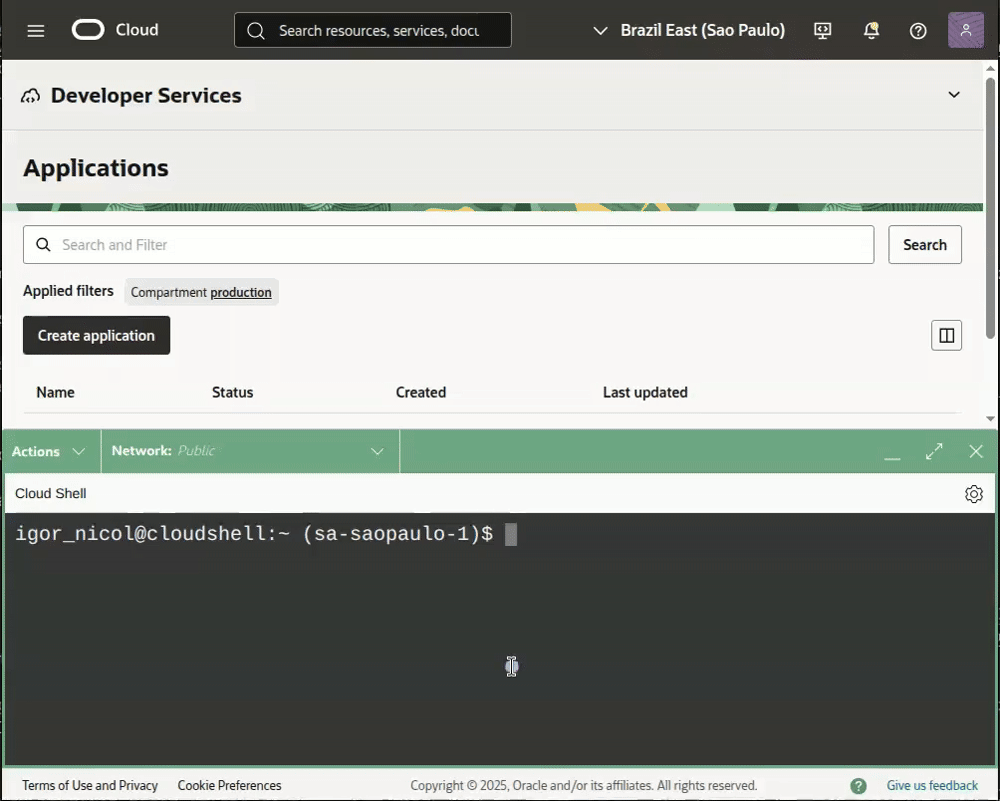

<h1> OCI Function: FinOps - Focus Report Extractor </h1>

[View this README in English](./readme_en-US.md) <span>&#127482;&#127480;</span>

Este conjunto de arquivos contém uma ***Function*** em Python desenvolvida para automatizar o processo de *download* e *upload* dos relatórios no padrão [**FOCUS**](https://focus.finops.org/) da sua *Tenancy* OCI para um *bucket* dentro da mesma *tenancy*.

<h3> Isenção de responsabilidade </h3>

Antes de prosseguir, é fundamental ter em mente que a utilização de quaisquer *scripts*, códigos ou comandos contidos neste repositório é de sua total responsabilidade. Os autores dos códigos não se responsabilizam por quaisquer ônus decorrentes do uso do conteúdo aqui disponibilizado.

**Recomendamos testar** todo o conteúdo em um ambiente apropriado e integrar os *scripts* de automação a uma infraestrutura de monitoramento robusta, a fim de acompanhar o funcionamento do processo e mitigar possíveis falhas.

Este projeto **não é um aplicativo oficial da Oracle** e, portanto, não possui suporte formal. A Oracle não se responsabiliza por nenhum conteúdo aqui presente.

<h2> Visão geral </h2>

<h3>Index</h3>

- [Requirements](#requirements)
  - [Permissions](#permissions)
  - [Networking](#networking)
- [Project files](#project-files)
- [Cloud Shell](#cloud-shell)
  - [Architecture X86\_64](#architecture-x86_64)
  - [Environment variables:](#environment-variables)
- [Function Application](#function-application)
- [OCI Function: context](#oci-function-context)
- [OCI Container Registry](#oci-container-registry)
- [Bucket](#bucket)
- [Work Directory](#work-directory)
- [Function](#function)
  - [Files](#files)
  - [Build](#build)
  - [Configuration](#configuration)
  - [Dynamic Group](#dynamic-group)
  - [Policy](#policy)
- [Resource Scheduler](#resource-scheduler)
  - [Dynamic Group](#dynamic-group-1)
  - [Policy](#policy-1)
- [Testing](#testing)
- [Logging](#logging)

## Requirements

Para dar continuidade a este procedimento, é necessário **cumprir os requisitos** a seguir:

### Permissions

As permissões são divididas em dois grupos de ações:

- **Para Criação de Recursos:**
  - *Bucket*
  - **Grupo Dinâmico** (*Dynamic Group*)
  - **Política de Acesso** (*Policy*)
  - *Function*
  - **OCI Container Registry**
  - **Resource Scheduler**

- **Para Acesso a Recursos:**
  - **Cloud Shell** (com acesso à internet)
  - **Relatórios de Custos e Uso** (*Cost and Usage Reports*)

### Networking

É mandatório que você possua uma **VCN** criada com uma **Subnet** que tenha endereços IP disponíveis para alocar a *Function*. Essa *Subnet* deve possuir **acesso à internet** ou ter um **Gateway de Serviços** ativo.

## Project files

A seguir estão os arquivos que compõem o projeto. Apenas três são essenciais; o `readme.md` pode ser ignorado no processo de implantação.

```
.
├── readme.md
├── func.py
├── func.yaml
└── requirements.txt
```

| Item | Descrição |
|------|-----------|
|readme.md|Este arquivo de documentação e auxílio.|
|**func.py**|O *script* em Python que será executado pela *function*.|
|**func.yaml**|O arquivo de configurações e características para a criação da *function*.|
|**requirements.txt**|A lista de módulos Python necessários para a execução do *script* `func.py`.|

## Cloud Shell

Para iniciar a criação e a configuração dos recursos, **abra o Cloud Shell**.


### Architecture X86\_64

Para o correto funcionamento dos recursos envolvidos neste procedimento, utilizaremos a **arquitetura x86\_64** como padrão.


**Valide a arquitetura** com o comando abaixo. O retorno esperado é "x86\_64:OK" para a configuração correta.

```BASH
[ "$(uname -m)" == "x86_64" ] && echo "$(uname -m):OK" || echo "$(uname -m):ERRO"
```

### Environment variables:

Antes de criar as variáveis de ambiente, verifique se todas foram configuradas corretamente.

```BASH
export FN_APP_NAME="FinOps"
export FN_FUNC_NAME="Focus-Report-Extractor"
export OCI_DOMAIN_NAME='Default'
export OCI_USERNAME='user.name@domain.com'
export OCI_BUCKET_NAME_DESTINATION="FinOps-Billing-Report"
export OCI_COMPARTMENT="ocid1.compartment.oc1..aaaaaaaa7_____1604"
export OCI_SUBNET='ocid1.subnet.oc1.<region>.aaaaaaaau_____1604'
export OCI_REPO_NAME="${FN_APP_NAME,,}_${FN_FUNC_NAME,,}"
export OCI_NAMESPACE=$(oci os ns get --raw-output --query 'data')

set|grep -E '^(FN_APP_NAME|FN_FUNC_NAME|OCI_REPO_NAME|OCI_NAMESPACE|OCI_COMPARTMENT|OCI_DOMAIN_NAME|OCI_USERNAME|OCI_REGION)'
```

| Variavel | Descricao |
|-|-|
|**FN_APP_NAME** |Nome da Application onde as functions serão criadas.|
|**FN_FUNC_NAME** |Nome da *Function*.|
|**OCI_DOMAIN_NAME** |Nome do domínio no qual o usuário utilizado está criado.|
|**OCI_USERNAME** |Nome do usuário a ser utilizado para a autenticação no OCI Registry.|
|**OCI_BUCKET_NAME_DESTINATION**|Nome do OCI Bucket que será utilizado para armazenar os arquivos FOCUS *Report*.|
|**OCI_COMPARTMENT** |OCID (*Oracle Cloud Identifier*) do *compartment* onde todos os recursos (Function Application, OCI Function, OCI Registry, etc.) serão criados.|
|**OCI_SUBNET** |OCID (*Oracle Cloud Identifier*) da *subnet* na qual a *function* será criada.|
|**OCI_REPO_NAME** |Nome do repositório no OCI Registry para armazenar as *images* da *function*.|
|**OCI_NAMESPACE** |Nome do *namespace* do OCI Object Storage do OCI Tenancy.|

Além dessas, serão utilizadas outras variáveis que já são previamente definidas no OCI Cloud Shell:

| Variavel | Descricao |
|-|-|
| **OCI_REGION** |Nome completo da região na qual o OCI Cloud Shell está conectado.|
| **OCI_TENANCY** |OCID (*Oracle Cloud Identifier*) do OCI Tenancy à qual estamos logados no OCI Cloud Shell.|

## Function Application

Crie uma **FN Application** com a arquitetura x86\_64 para hospedar a *function*. Se já possuir uma, *export* o OCID (*Oracle Cloud Identifier*) para a variável de ambiente ***FN_APP_OCID*** e o nome para ***FN_APP_NAME*** para facilitar o uso posterior.

Para criar a *application*, utilize o comando abaixo, que já exporta o OCID (*Oracle Cloud Identifier*) para uma variável de ambiente.

```BASH
export FN_APP_OCID=$(oci fn application create \
--display-name ${FN_APP_NAME} \
--compartment-id ${OCI_COMPARTMENT} \
--subnet-ids "[\"${OCI_SUBNET}\"]" \
--shape "GENERIC_X86" \
--raw-output \
--query 'data.id')

set | grep -E '^(FN_APP_OCID)'
```

## OCI Function: context

É necessário realizar algumas **configurações de contexto** para o cliente `fn` do OCI Functions.

```BASH
fn use context ${OCI_REGION}
fn update context oracle.compartment-id ${OCI_COMPARTMENT}
fn update context registry ${OCI_REGION}.ocir.io/${OCI_NAMESPACE}/${OCI_REPO_NAME}
fn update context oracle.image-compartment-id ${OCI_COMPARTMENT}
fn list context
```

## OCI Container Registry

É fundamental utilizar um **Auth Token como senha** durante o processo de *login* no **OCI Container Registry**.

Caso você não possua um *Auth Token* criado, gere um novo utilizando o seguinte comando:

```BASH
oci iam auth-token create \
--user-id ${OCI_CS_USER_OCID} \
--description "OCI Container Registry" \
--raw-output \
--query 'data.token'
```

Este é o comando para efetuar o _login_ no **OCI Container Registry**:

> [!TIP]
> Caso você tenha acabado de criar o **Auth Token**, **aguarde alguns minutos** antes de utilizá-lo. Pode levar um tempo até que o *token* seja propagado e esteja pronto para efetuar *login* no OCI Container Registry.

```BASH
docker login -u "${OCI_NAMESPACE}/${OCI_DOMAIN_NAME}/${OCI_USERNAME}" ${OCI_REGION}.ocir.io
```

## Bucket

Este *Bucket* receberá todos os arquivos **FOCUS Report** que a *function* localizar para a *Tenancy*.

```BASH
oci os bucket create --name ${OCI_BUCKET_NAME_DESTINATION} \
--storage-tier "STANDARD" \
--namespace-name ${OCI_NAMESPACE} \
--compartment-id ${OCI_COMPARTMENT}
```

## Work Directory

Vamos **criar um diretório** para organizar todos os nossos arquivos e, em seguida, iniciar a **criação dos nossos arquivos** e o *build* da nossa *function*.

```BASH
mkdir -p ~/oci-functions/${FN_FUNC_NAME,,}
cd ~/oci-functions/${FN_FUNC_NAME,,}
```

## Function
### Files

A funcao desses arquivos foi detalhada na seção [Project files](#project-files).

```BASH
cat << EOF > requirements.txt
oci>=2.155
fdk
EOF
```

```BASH
cat << EOF > func.yaml
schema_version: 20180708
name: ${FN_FUNC_NAME,,}
version: 0.0.1
runtime: python
entrypoint: /python/bin/fdk /function/func.py handler
memory: 128
timeout: 300
EOF
```

O arquivo `func.py` precisa ser enviado (via *upload*) para o nosso **diretório de trabalho** (*work directory*).



Após realizar o upload utilizando o botão no canto superior direito, mova o arquivo para o **diretório de trabalho** (*work directory*) criado anteriormente.

```BASH
mv ~/func.py .
```

### Build

O próximo comando executará as seguintes etapas:

- Cria a *image* da *function* com Python e todos os módulos listados em `requirements.txt`.
- Cria o repositório no **OCI Container Registry** para o *upload* da *image*.
- Cria a *function* com as características definidas em `func.yaml` dentro da **Function Application**.

```BASH
fn --verbose deploy --app "${FN_APP_NAME}"
```

Após a conclusão bem-sucedida do *build* e do *deploy* da *image* da *function*, é necessário **obter o OCID** (*Oracle Cloud Identifier*) da *function* para liberar seu acesso aos recursos necessários.

Execute o comando abaixo para **consultar o OCID** (*Oracle Cloud Identifier*) da *function*:

```BASH
export FN_FUNC_OCID=$(oci fn function list \
--application-id ${FN_APP_OCID} \
--raw-output \
--query "data[?contains(\"display-name\", '${FN_FUNC_NAME,,}')].id | [0]")

set | grep -E '^(FN_FUNC_OCID)'
```

### Configuration

Para garantir a flexibilidade da solução, a *function* utilizará **variáveis** para receber dados que podem variar em cada *tenancy*.

| Variavel | Descrição |
|----------|-----------|
|OCI_BUCKET_DESTINATION|Nome do *Bucket* que será utilizado para **armazenar os arquivos FOCUS Report**.|
|OCI_TENANCY_OCID|O **OCID** (*Oracle Cloud Identifier*) da *Tenancy*.|

```BASH
fn config function ${FN_APP_NAME} ${FN_FUNC_NAME,,} OCI_BUCKET_DESTINATION ${OCI_BUCKET_NAME_DESTINATION}
fn config function ${FN_APP_NAME} ${FN_FUNC_NAME,,} OCI_TENANCY_OCID ${OCI_TENANCY}
```

### Dynamic Group

Para **conceder as permissões** necessárias para a *function* acessar os relatórios FOCUS e o *bucket* de destino, é fundamental criar um **Grupo Dinâmico (Dynamic Group)**, conforme o comando abaixo:

```BASH
export DYG_FUNCTION="DYG_${FN_APP_NAME}_${FN_FUNC_NAME}_Function"

oci iam dynamic-group create \
--name ${DYG_FUNCTION} \
--description "Dynamic group para a function que extrai os relatorios FOCUS do billing." \
--matching-rule "ALL {resource.type = 'fnfunc', resource.id = '${FN_FUNC_OCID}'}"
```

> [!NOTE]
A **`matching-rule`** deste **Grupo Dinâmico** selecionará exclusivamente a sua *function*, independentemente do *compartment* de criação.

### Policy

Esta política de acesso concederá à *function* a liberação para acessar os relatórios FOCUS e o *bucket* de destino, utilizando o grupo dinâmico criado.

```BASH
cat <<EOF > /tmp/function_focus_report_extractor.policy
[
    "Define tenancy usage-report as ocid1.tenancy.oc1..aaaaaaaaned4fkpkisbwjlr56u7cj63lf3wffbilvqknstgtvzub7vhqkggq",
    "Endorse dynamic-group ${DYG_FUNCTION} to read objects in tenancy usage-report",
    "Allow dynamic-group ${DYG_FUNCTION} to manage objects in compartment id ${OCI_COMPARTMENT} where target.bucket.name='${OCI_BUCKET_NAME_DESTINATION}'",
    "Allow dynamic-group ${DYG_FUNCTION} to manage buckets in compartment id ${OCI_COMPARTMENT} where target.bucket.name='${OCI_BUCKET_NAME_DESTINATION}'"
]
EOF

export POL_NAME="POL_${FN_APP_NAME}_${FN_FUNC_NAME}_Function"

oci iam policy create \
--name "${POL_NAME}" \
--description "Permissoes para a function que extrai os relatorios FOCUS do billing." \
--compartment-id ${OCI_TENANCY} \
--statements file:///tmp/function_focus_report_extractor.policy
```

> [!IMPORTANT]
Por conter uma regra de [**`endorse`**](https://docs.oracle.com/en-us/iaas/database-tools/doc/cross-tenancy-policies.html), esta política deve ser criada no *compartment* **raiz** (**Tenancy**) do ambiente.

## Resource Scheduler

Para a execução automatizada, utilizaremos o serviço PaaS de **Agendamento (Resource Scheduler)** do OCI.

O agendamento será configurado para **duas execuções diárias**:

- **00:00 UTC** (Meia-noite)
- **12:00 UTC** (Meio-dia)

Lembre-se de que o agendamento é configurado no fuso horário **UTC**. Caso sua região tenha um deslocamento de **-3 horas** em relação ao UTC (como o fuso horário de São Paulo, Brasil), ajuste os horários de execução conforme necessário.

```BASH
export CRON_SCHEDULER="3,15"

export RESOURCE_SCHEDULER_OCID=$(oci resource-scheduler schedule create \
--display-name "${FN_APP_NAME} - ${FN_FUNC_NAME}" \
--description "${FN_APP_NAME} - ${FN_FUNC_NAME} Scheduler" \
--compartment-id ${OCI_COMPARTMENT} \
--action "START_RESOURCE" \
--recurrence-details "0 ${CRON_SCHEDULER} * * *" \
--recurrence-type "CRON" \
--resources "[{\"id\":\"${FN_FUNC_OCID}\",\"metadata\":null,\"parameters\":null}]" \
--raw-output \
--query 'data.id')

set | grep -E '^(RESOURCE_SCHEDULER_OCID)'
```

### Dynamic Group

De forma análoga à *Function*, é necessário criar um **Grupo Dinâmico (Dynamic Group)** específico para o nosso agendamento, conforme o comando abaixo:

```BASH
export DYG_RESOURCE_SCHEDULER="DYG_${FN_APP_NAME}_${FN_FUNC_NAME}_Scheduler"

oci iam dynamic-group create \
--name ${DYG_RESOURCE_SCHEDULER} \
--description "Dynamic group para o Resource Scheduler que vai executar a function que extrai os relatorios FOCUS do billing." \
--matching-rule "All {resource.type='resourceschedule', resource.id='${RESOURCE_SCHEDULER_OCID}'}"
```

> [!NOTE]
A **matching-rule** deste *Dynamic Group* selecionará exclusivamente o nosso agendamento, independentemente do compartment onde ela foi criada.

### Policy

Esta política de acesso concederá permissão ao agendamento para **invocar a nossa _function_**, utilizando o grupo dinâmico que será criado.

```BASH
export POL_RESOURCE_SCHEDULER="POL_${FN_APP_NAME}_${FN_FUNC_NAME}_Scheduler"

oci iam policy create \
--name "${POL_RESOURCE_SCHEDULER}" \
--description "Permissoes para a function que extrai os relatorios FOCUS do billing." \
--compartment-id ${OCI_COMPARTMENT} \
--statements "[\"Allow dynamic-group ${DYG_RESOURCE_SCHEDULER} to use functions-family in compartment id ${OCI_COMPARTMENT}\"]"
```

> [!IMPORTANT]
A política de acesso será criada no mesmo *compartment* de todos os demais recursos, conforme definido pela variável `OCI_COMPARTMENT`.

## Testing

> [!TIP]
Após concluir o processo de criação com sucesso, **aguarde alguns minutos**. Essa pausa é crucial para garantir que o sistema carregue e atualize os *caches* de permissões, especialmente as novas políticas concedidas à OCI Function e ao OCI Resource Scheduler.

Para **verificar o funcionamento** da *function*, utilize o comando abaixo:

```BASH
fn invoke ${FN_APP_NAME} ${FN_FUNC_NAME,,}
```

Este comando **invocará a *function*** e retornará os dados de execução. O resultado esperado é semelhante a este:

`{"time": 0.7955700970001089, "orig": 1604, "dest": 1604, "copy": 0, "erro": 0}`

|item|descricao|
|----|---------|
|time|**Tempo total de execução** do *script*, em segundos.|
|orig|**Quantidade de arquivos** encontrados na origem.|
|dest|**Quantidade de arquivos** já existentes no *bucket* de destino.|
|copy|**Quantidade de arquivos novos** copiados com sucesso para o *bucket* de destino.|
|erro|**Quantidade de arquivos** que apresentaram erro durante a cópia para o *bucket* de destino.|

## Logging

Caso ocorram problemas ou erros, **ative o _log_ e acompanhe os eventos** para identificar e corrigir eventuais falhas.

Neste *link*, [Oracle Cloud: Problemas ao invocar funções](https://docs.oracle.com/en-us/iaas/Content/Functions/Tasks/functionstroubleshooting_topic-Issues-invoking-functions.htm), você encontrará diversos **problemas conhecidos** e possíveis **soluções** para cada cenário.


> [!IMPORTANT]
O **Log da _function_ não é habilitado por padrão**. Se necessário você precisa ativá-lo manualmente.