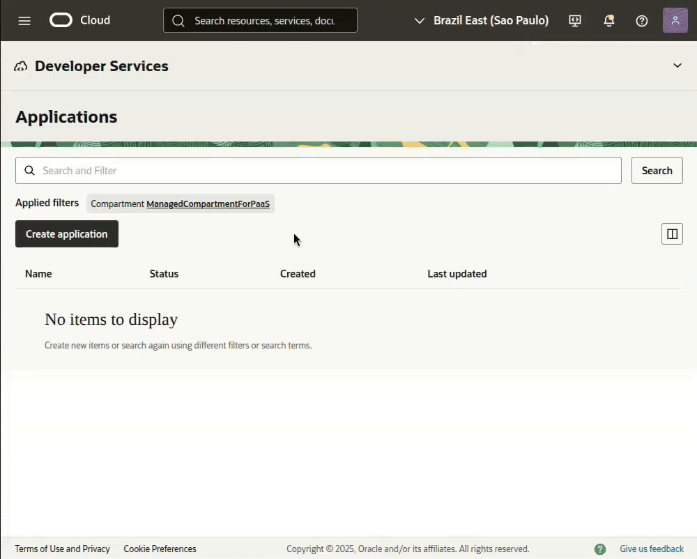

<h1> OCI Function: FinOps - Focus Report Extractor </h1>

[Veja esse README em Portugues](./readme.md) <span>&#x1f1e7;&#x1f1f7;</span>

This set of files contains a ***Function*** in Python designed to automate the process of *downloading* and *uploading* reports in the [**FOCUS**](https://focus.finops.org/) standard from your OCI *tenancy* to a *bucket* within the same *tenancy*.

<h3> Disclaimer </h3>

Before proceeding, it is essential to bear in mind that the use of any *scripts*, codes or commands contained in this repository is at your own risk. The authors of the code are not responsible for any charges arising from the use of the content provided here.

**We recommend testing** all the content in an appropriate environment and integrating the automation *scripts* with a robust monitoring infrastructure in order to keep track of how the process is working and mitigate possible failures.

This project **is not an official Oracle application** and therefore has no formal support. Oracle is not responsible for any content contained herein.

<h2> Overview </h2>

<h3>Index</h3>

- [Requirements](#requirements)
  - [Permissions](#permissions)
  - [Networking](#networking)
- [Project files](#project-files)
- [Cloud Shell](#cloud-shell)
  - [Architecture X86\_64](#architecture-x86_64)
  - [Environment variables:](#environment-variables)
- [Function Application](#function-application)
- [OCI Function: context](#oci-function-context)
- [OCI Container Registry](#oci-container-registry)
- [Bucket](#bucket)
- [Work Directory](#work-directory)
- [Function](#function)
  - [Files](#files)
  - [Build](#build)
  - [Configuration](#configuration)
  - [Dynamic Group](#dynamic-group)
  - [Policy](#policy)
- [Resource Scheduler](#resource-scheduler)
  - [Dynamic Group](#dynamic-group-1)
  - [Policy](#policy-1)
- [Testing](#testing)
- [Logging](#logging)

## Requirements

To continue with this procedure, **the following requirements must be met**:

### Permissions

Permissions are divided into two groups of actions:

- **For Resource Creation:**
  - *Bucket*
  - *Dynamic Group*
  - **Access***Policy*
  - *Function*
  - **OCI Container Registry**
  - **Resource Scheduler**

- **For Resource Access:**
  - **Cloud Shell** (with internet access)
  - *Cost and Usage***Reports**

### Networking

It is mandatory that you have a **VCN** created with a **Subnet** that has IP addresses available to allocate to *Function*. This *Subnet* must have **Internet access** or an active **Service Gateway**.

## Project files

Below are the files that make up the project. Only three are essential; `readme.md` can be ignored in the deployment process.

```
.
├── readme.md
├── func.py
├── func.yaml
└── requirements.txt
```

|Item                |Description                                                                  |
|--------------------|-----------------------------------------------------------------------------|
|readme.md           |This is a documentation and help file.                                       |
|**func.py**         |O *script* Python file that will be executed by *function*.                  |
|**func.yaml**       |The configuration and features file for creating the *function*.             |
|**requirements.txt**|The list of Python modules needed to run the Cloud Shell. *script* `func.py`.|


## Cloud Shell

To start creating and configuring the resources, **open the Cloud Shell**.



### Architecture X86\_64

For the proper functioning of the resources involved in this procedure, we will use the **x86\_64 architecture** as the standard.


Validate the architecture with the command below. The expected return is "x86\_64:OK" for the correct configuration.

```BASH
[ "$(uname -m)" == "x86_64" ] && echo "$(uname -m):OK" || echo "$(uname -m):ERRO"
```

### Environment variables:

Before creating the environment variables, check if they have all been configured correctly.

```BASH
export FN_APP_NAME="FinOps"
export FN_FUNC_NAME="Focus-Report-Extractor"
export OCI_DOMAIN_NAME='Default'
export OCI_USERNAME='user.name@domain.com'
export OCI_BUCKET_NAME_DESTINATION="FinOps-Billing-Report"
export OCI_COMPARTMENT="ocid1.compartment.oc1..aaaaaaaa7_____1604"
export OCI_SUBNET='ocid1.subnet.oc1.<region>.aaaaaaaau_____1604'
export OCI_REPO_NAME="${FN_APP_NAME,,}_${FN_FUNC_NAME,,}"
export OCI_NAMESPACE=$(oci os ns get --raw-output --query 'data')

set|grep -E '^(FN_APP_NAME|FN_FUNC_NAME|OCI_REPO_NAME|OCI_NAMESPACE|OCI_COMPARTMENT|OCI_DOMAIN_NAME|OCI_USERNAME|OCI_REGION)'
```

| Variable | Description |
|-|-|
|**FN_APP_NAME** |Name of the Application where the functions will be created.|
|**FN_FUNC_NAME** |Name of the *Function*.|
|**OCI_DOMAIN_NAME** |Name of the domain in which the user being used is created.|
|**OCI_USERNAME** |Name of the user to be used for authentication in the OCI Registry.|
|**OCI_BUCKET_NAME_DESTINATION**|Name of the OCI Bucket that will be used to store the FOCUS *Report* files.|
|**OCI_COMPARTMENT** |OCID (*Oracle Cloud Identifier*) of the *compartment* where all resources (Function Application, OCI Function, OCI Registry, etc.) will be created.|
|**OCI_SUBNET** |OCID (*Oracle Cloud Identifier*) of the *subnet* in which the *function* will be created.|
|**OCI_REPO_NAME** |Name of the repository in the OCI Registry to store the *function* images.|
|**OCI_NAMESPACE** |Name of the OCI Object Storage *namespace* of the OCI Tenancy.|

In addition to these, other variables that are already predefined in the OCI Cloud Shell will be used:

| Variable | Description |
|-|-|
| **OCI_REGION** | Full name of the region to which the OCI Cloud Shell is connected. |
| **OCI_TENANCY** | OCID (*Oracle Cloud Identifier*) of the OCI Tenancy to which we are logged in on the OCI Cloud Shell. |

## Function Application

Create a **FN Application** with the x86_64 architecture to host the *function*. If you already have one, *export* the OCID (*Oracle Cloud Identifier*) to the environment variable ***FN_APP_OCID*** and the name to ***FN_APP_NAME*** for easier use later.

To create the *application*, use the command below, which already exports the OCID (*Oracle Cloud Identifier*) to an environment variable.

```BASH
export FN_APP_OCID=$(oci fn application create \
--display-name ${FN_APP_NAME} \
--compartment-id ${OCI_COMPARTMENT} \
--subnet-ids "[\"${OCI_SUBNET}\"]" \
--shape "GENERIC_X86" \
--raw-output \
--query 'data.id')

set | grep -E '^(FN_APP_OCID)'
```

## OCI Function: context

It is necessary to perform some **context configurations** for the OCI Functions `fn` client.

```BASH
fn use context ${OCI_REGION}
fn update context oracle.compartment-id ${OCI_COMPARTMENT}
fn update context registry ${OCI_REGION}.ocir.io/${OCI_NAMESPACE}/${OCI_REPO_NAME}
fn update context oracle.image-compartment-id ${OCI_COMPARTMENT}
fn list context
```

## OCI Container Registry

It is essential to use an **Auth Token as a password** during the *login* process to the **OCI Container Registry**.

If you do not have an *Auth Token* created, generate a new one using the following command:

```BASH
oci iam auth-token create \
--user-id ${OCI_CS_USER_OCID} \
--description "OCI Container Registry" \
--raw-output \
--query 'data.token'
```

This is the command to perform _login_ to the **OCI Container Registry**:

> [!TIP]
> If you have just created the **Auth Token**, **wait a few minutes** before using it. It may take some time for the *token* to propagate and be ready to perform *login* to the OCI Container Registry.

```BASH
docker login -u "${OCI_NAMESPACE}/${OCI_DOMAIN_NAME}/${OCI_USERNAME}" ${OCI_REGION}.ocir.io
```

## Bucket

This *Bucket* will receive all the **FOCUS Report** files that the *function* locates for the *Tenancy*.

```BASH
oci os bucket create --name ${OCI_BUCKET_NAME_DESTINATION} \
--storage-tier "STANDARD" \
--namespace-name ${OCI_NAMESPACE} \
--compartment-id ${OCI_COMPARTMENT}
```

## Work Directory

Let's **create a directory** to organize all our files and then start the **creation of our files** and the *build* of our *function*.

```BASH
mkdir -p ~/oci-functions/${FN_FUNC_NAME,,}
cd ~/oci-functions/${FN_FUNC_NAME,,}
```

## Function
### Files

The function of these files was detailed in the [Project files](#project-files) section.

```BASH
cat << EOF > requirements.txt
oci>=2.155
fdk
EOF
```

```BASH
cat << EOF > func.yaml
schema_version: 20180708
name: ${FN_FUNC_NAME,,}
version: 0.0.1
runtime: python
entrypoint: /python/bin/fdk /function/func.py handler
memory: 128
timeout: 300
EOF
```

The file `func.py` needs to be uploaded to our **work directory**.


After uploading using the button at the top right corner, move the file to the **work directory** created earlier.

```BASH
mv ~/func.py .
```

### Build

The next command will perform the following steps:

- Creates the Python function image with all modules listed in `requirements.txt`.
- Creates the repository in the **OCI Container Registry** for uploading the image.
- Creates the function with the characteristics defined in `func.yaml` within the **Function Application**.

```BASH
fn --verbose deploy --app "${FN_APP_NAME}"
```

After successfully building and deploying the function image, it is necessary to **obtain the OCID** (*Oracle Cloud Identifier*) of the function to grant it access to the required resources.

Run the following command to **query the OCID** (*Oracle Cloud Identifier*) of the function:

```BASH
export FN_FUNC_OCID=$(oci fn function list \
--application-id ${FN_APP_OCID} \
--raw-output \
--query "data[?contains(\"display-name\", '${FN_FUNC_NAME,,}')].id | [0]")

set | grep -E '^(FN_FUNC_OCID)'
```

### Configuration

To ensure solution flexibility, the function will use **variables** to receive data that may vary in each tenancy.

| Variable             | Description                                                               |
|----------------------|---------------------------------------------------------------------------|
|OCI_BUCKET_DESTINATION|Name of the *Bucket* that will be used to **store the FOCUS Report files**.|
|OCI_TENANCY_OCID      |The **OCID** (*Oracle Cloud Identifier*) of the *Tenancy*.                 |

```BASH
fn config function ${FN_APP_NAME} ${FN_FUNC_NAME,,} OCI_BUCKET_DESTINATION ${OCI_BUCKET_NAME_DESTINATION}
fn config function ${FN_APP_NAME} ${FN_FUNC_NAME,,} OCI_TENANCY_OCID ${OCI_TENANCY}
```

### Dynamic Group

To **grant the necessary permissions** for the function to access the FOCUS reports and the destination bucket, it is essential to create a **Dynamic Group**, as per the command below:

```BASH
export DYG_FUNCTION="DYG_${FN_APP_NAME}_${FN_FUNC_NAME}_Function"

oci iam dynamic-group create \
--name ${DYG_FUNCTION} \
--description "Dynamic group for the function that extracts FOCUS reports from billing." \
--matching-rule "ALL {resource.type = 'fnfunc', resource.id = '${FN_FUNC_OCID}'}"
```

> [!NOTE]
The **`matching-rule`** of this **Dynamic Group** will exclusively select your *function*, regardless of the *compartment* where it was created.

### Policy

This access policy will grant the *function* permission to access the FOCUS reports and the target *bucket*, using the created dynamic group.

```BASH
cat <<EOF > /tmp/function_focus_report_extractor.policy
[
    "Define tenancy usage-report as ocid1.tenancy.oc1..aaaaaaaaned4fkpkisbwjlr56u7cj63lf3wffbilvqknstgtvzub7vhqkggq",
    "Endorse dynamic-group ${DYG_FUNCTION} to read objects in tenancy usage-report",
    "Allow dynamic-group ${DYG_FUNCTION} to manage objects in compartment id ${OCI_COMPARTMENT} where target.bucket.name='${OCI_BUCKET_NAME_DESTINATION}'",
    "Allow dynamic-group ${DYG_FUNCTION} to manage buckets in compartment id ${OCI_COMPARTMENT} where target.bucket.name='${OCI_BUCKET_NAME_DESTINATION}'"
]
EOF

export POL_NAME="POL_${FN_APP_NAME}_${FN_FUNC_NAME}_Function"

oci iam policy create \
--name "${POL_NAME}" \
--description "Permissions for the function that extracts FOCUS reports from billing." \
--compartment-id ${OCI_TENANCY} \
--statements file:///tmp/function_focus_report_extractor.policy
```

> [!IMPORTANT]
Because it contains an [**`endorse`**](https://docs.oracle.com/en-us/iaas/database-tools/doc/cross-tenancy-policies.html) rule, this policy must be created in the **root** (**Tenancy**) *compartment* of the environment.

## Resource Scheduler

For automated execution, we will use the OCI PaaS service **Scheduling (Resource Scheduler)**.

The schedule will be configured for **two daily executions**:

- **00:00 UTC** (Midnight)
- **12:00 UTC** (Noon)

Remember that the schedule is set in the **UTC** time zone. If your region has a **-3 hour** offset from UTC (such as the São Paulo, Brazil time zone), adjust the execution times accordingly.

```BASH
export CRON_SCHEDULER="3,15"

export RESOURCE_SCHEDULER_OCID=$(oci resource-scheduler schedule create \
--display-name "${FN_APP_NAME} - ${FN_FUNC_NAME}" \
--description "${FN_APP_NAME} - ${FN_FUNC_NAME} Scheduler" \
--compartment-id ${OCI_COMPARTMENT} \
--action "START_RESOURCE" \
--recurrence-details "0 ${CRON_SCHEDULER} * * *" \
--recurrence-type "CRON" \
--resources "[{\"id\":\"${FN_FUNC_OCID}\",\"metadata\":null,\"parameters\":null}]" \
--raw-output \
--query 'data.id')

set | grep -E '^(RESOURCE_SCHEDULER_OCID)'
```

### Dynamic Group

Similarly to the *Function*, it is necessary to create a specific **Dynamic Group** for our scheduling, as per the command below:

```BASH
export DYG_RESOURCE_SCHEDULER="DYG_${FN_APP_NAME}_${FN_FUNC_NAME}_Scheduler"

oci iam dynamic-group create \
--name ${DYG_RESOURCE_SCHEDULER} \
--description "Dynamic group for the Resource Scheduler that will execute the function that extracts the FOCUS reports from billing." \
--matching-rule "All {resource.type='resourceschedule', resource.id='${RESOURCE_SCHEDULER_OCID}'}"
```

> [!NOTE]
The **matching-rule** of this *Dynamic Group* will exclusively select our scheduler, regardless of the compartment where it was created.

### Policy

This access policy will grant permission to the scheduler to **invoke our _function_**, using the dynamic group that will be created.

```BASH
export POL_RESOURCE_SCHEDULER="POL_${FN_APP_NAME}_${FN_FUNC_NAME}_Scheduler"

oci iam policy create \
--name "${POL_RESOURCE_SCHEDULER}" \
--description "Permissions for the function that extracts the FOCUS reports from billing." \
--compartment-id ${OCI_COMPARTMENT} \
--statements "[\"Allow dynamic-group ${DYG_RESOURCE_SCHEDULER} to use functions-family in compartment id ${OCI_COMPARTMENT}\"]"
```

> [!IMPORTANT]
The access policy will be created in the same compartment as all other resources, as defined by the variable `OCI_COMPARTMENT`.

## Testing

> [!TIP]
After successfully completing the creation process, **wait a few minutes**. This pause is crucial to ensure the system loads and updates the permission caches, especially the new policies granted to the OCI Function and the OCI Resource Scheduler.

To **verify the function's operation**, use the command below:

```BASH
fn invoke ${FN_APP_NAME} ${FN_FUNC_NAME,,}
```

This command **will invoke the function** and return the execution data. The expected result is similar to this:

`{"time": 0.7955700970001089, "orig": 1604, "dest": 1604, "copy": 0, "erro": 0}`

|item|description|
|----|---------|
|time|**Total execution time** of the script, in seconds.|
|orig|**Number of files** found at the source.|
|dest|**Number of files** already existing in the destination bucket.|
|copy|**Number of new files** successfully copied to the destination bucket.|
|erro|**Number of files** that encountered errors during copying to the destination bucket.|

## Logging

If problems or errors occur, **enable logging and monitor the events** to identify and fix any issues.

In this link, [Oracle Cloud: Issues Invoking Functions](https://docs.oracle.com/en-us/iaas/Content/Functions/Tasks/functionstroubleshooting_topic-Issues-invoking-functions.htm), you will find several **known issues** and possible **solutions** for each scenario.


> [!IMPORTANT]
The **function log is not enabled by default**. If necessary, you need to activate it manually.